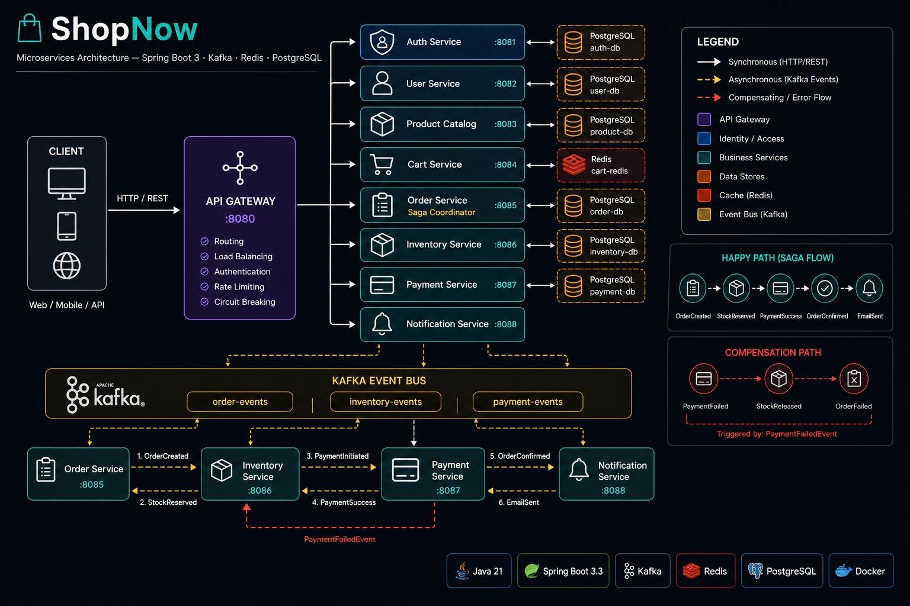

# ShopNow — Spring Boot Microservices

A production-style e-commerce backend showcasing **choreography-based Saga**, **event-driven architecture** via Apache Kafka, and **resilience patterns** with Resilience4j. Built entirely with Java 21 and Spring Boot 3.

---

## Architecture

<!-- TODO: add architecture diagram -->
 

### Saga Flow

**Happy path:**
```
OrderCreatedEvent
  → [Inventory] reserve stock       → InventoryReservedEvent
  → [Payment]   process payment     → PaymentSuccessEvent
  → [Order]     confirm order       → OrderConfirmedEvent
  → [Notification] send email
```

**Compensation (payment fails):**
```
OrderCreatedEvent
  → [Inventory] reserve stock       → InventoryReservedEvent
  → [Payment]   fails               → PaymentFailedEvent
  → [Inventory] release stock
  → [Order]     mark FAILED
  → [Notification] send failure email
```

Kafka topics: `order-events`, `inventory-events`, `payment-events`

---

## Services

| Service | Port | Description |
|---|---|---|
| API Gateway | 8080 | Spring Cloud Gateway — JWT validation and routing |
| Auth Service | 8081 | Registration, login, JWT + refresh token (HttpOnly cookie) |
| User Service | 8082 | User profiles and addresses |
| Product Catalog | 8083 | Products and categories CRUD |
| Cart Service | 8084 | Shopping cart backed by Redis (7-day TTL) |
| Order Service | 8085 | Order creation, Saga coordinator |
| Inventory Service | 8086 | Stock management and reservations |
| Payment Service | 8087 | Simulated payment processing via Stripe |
| Notification Service | 8088 | Email notifications via MailHog (local) |

---

## Tech Stack

| Layer | Technology |
|---|---|
| Language | Java 21 |
| Framework | Spring Boot 3.3.5 |
| Gateway | Spring Cloud Gateway (reactive) |
| Messaging | Apache Kafka 7.5.0 (KRaft, no ZooKeeper) |
| Auth | Spring Security + JJWT 0.12.3 |
| Persistence | Spring Data JPA + PostgreSQL 15 |
| Cache | Redis 7 |
| Resilience | Resilience4j (circuit breaker) |
| Build | Maven |
| Infra | Docker Compose |

---

## Project Structure

```
shopnow-ecommerce/
├── services/
│   ├── api-gateway/
│   ├── auth-service/
│   ├── user-service/
│   ├── product-catalog/
│   ├── cart-service/
│   ├── order-service/
│   ├── inventory-service/
│   ├── payment-service/
│   └── notification-service/
├── shared/           # shared event payloads and DTOs
├── docker/
│   └── postgres/
│       └── init.sql  # creates all service databases
├── docs/
└── docker-compose.yaml
```

---

## API Reference

### Auth Service — `POST /api/v1/auth/*`

| Method | Endpoint | Auth | Description |
|---|---|---|---|
| POST | `/register` | None | Create account, returns JWT |
| POST | `/login` | None | Returns access token; sets `refresh_token` HttpOnly cookie |
| POST | `/refresh` | Cookie | Rotates both tokens |

### Cart Service — `POST /api/v1/cart/*`

| Method | Endpoint | Auth | Description |
|---|---|---|---|
| GET | `/cart` | JWT | Get current cart |
| POST | `/cart/items` | JWT | Add item (validates against Product Catalog) |
| PUT | `/cart/items/{productId}` | JWT | Update quantity |
| DELETE | `/cart/items/{productId}` | JWT | Remove item |
| DELETE | `/cart` | JWT | Clear cart |
| GET | `/internal/cart/{userId}` | Internal | Inter-service read |

### Gateway Auth Rules

- **JWT required:** `GET|POST /users/**`, non-GET `/products/**`, non-GET `/categories/**`
- **Public:** `POST /auth/**`, `GET /products/**`, `GET /categories/**`

---

## Getting Started

### Prerequisites

- Java 21
- Docker + Docker Compose
- Maven

### 1. Configure environment

Create a `.env` file at the project root:

```env
POSTGRES_PASSWORD=your_postgres_password
JWT_SECRET=your_jwt_secret_min_256_bits
JWT_EXPIRATION=900000
JWT_REFRESH_EXPIRATION=604800000
STRIPE_SECRET_KEY=sk_test_...
```

### 2. Start infrastructure and services

```bash
docker compose up -d
```

Starts Kafka (KRaft), PostgreSQL, Redis, MailHog, and all nine services.

PostgreSQL databases are created automatically by `docker/postgres/init.sql`.

### 3. Run a service locally (optional)

```bash
cd services/auth-service
JWT_SECRET=... JWT_EXPIRATION=900000 JWT_REFRESH_EXPIRATION=604800000 mvn spring-boot:run
```

All services can run standalone against the Dockerised infrastructure.

### Local mail

MailHog captures outbound email in dev. Open `http://localhost:8025` to view.

---

## Design Decisions

- **Choreography over orchestration** — no central Saga orchestrator; services react to events and emit compensating events on failure.
- **Idempotent handlers** — every event carries a `correlationId` used to deduplicate processing.
- **Constructor injection everywhere** — `@RequiredArgsConstructor` (Lombok); no field injection.
- **Records for DTOs** — immutable request/response types using Java records.
- **No service discovery** — services communicate via env-var URLs (`${SERVICE_URL}`), Docker-network hostnames in Compose.

---

## What This Project Does Not Cover

Rate limiting, service discovery (Eureka), Config Server, CQRS, Elasticsearch, Kubernetes, and frontend. This is intentional — the focus is on the Saga pattern and event-driven communication.
